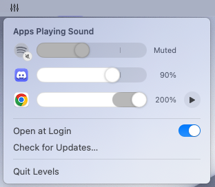

# Levels

**A volume knob for every app on your Mac.**

Turn down a noisy video call without muting your music. Boost a quiet YouTube video without blasting your notifications. Levels lives in your menu bar and gives each app that's playing sound its own volume slider.

  <picture>
    <source media="(prefers-color-scheme: dark)" srcset="docs/screenshot-dark.png">
    
  </picture>

macOS only has one volume for everything. Levels adds a volume for each app.

## Features

- **A slider for each app.** Only apps that are actually playing sound show up, so the list stays short. Quick notification blips are ignored.
- **Boost up to 200%.** Past 100%, the slider turns grey to show you're in boost range. A small notch marks 100%. Boosted audio is gently limited so it doesn't crackle or distort.
- **One-click mute.** Click an app's icon to mute it, and click again to unmute. Levels remembers the volume you had, and dragging the slider also unmutes.
- **Remembers every app.** Set Discord to 60% once and it stays at 60%, even after you restart your Mac.
- **Play and pause from the menu.** The app your keyboard's play/pause key controls gets a ▶︎ button. Hover over it to see what's playing, or right-click the row for next and previous track.
- **Smooth, not jumpy.** Volume changes and mutes fade in a fraction of a second instead of cutting off abruptly.
- **Follows your speakers and headphones.** Switch from speakers to AirPods and your per-app levels come along.
- **Stays out of the way.** It lives in the menu bar with no Dock icon, can open at login, and matches light and dark mode.
- **Updates itself.** New versions arrive automatically, or use **Check for Updates…** in the menu.
- **Accessible.** Works with VoiceOver, Increase Contrast, and Reduce Motion.

## How to use it

1. Click the **sliders icon** in your menu bar.
2. Drag an app's slider to change its volume.
3. Click an app's icon to mute it. Right-click the row to **Reset to 100%**.

Your Mac's main volume still works as usual. Levels sets each app's volume relative to it.

## Install

1. Download the latest **Levels-*version*.dmg** from [Releases](https://github.com/lejuste/Levels/releases/latest).
2. Open it and drag **Levels** into **Applications**.
3. Open Levels. The first time, macOS asks to allow **System Audio Recording**. Levels needs this to change other apps' volume.

Requires **macOS 15 (Sequoia)** or later. There's no audio driver or system extension to install.

**To uninstall:** choose **Quit Levels** from its menu, then drag Levels from Applications to the Trash.

## Questions

**Does Levels record my audio?**
No. macOS calls the permission "System Audio Recording" because Levels has to pass audio through itself to change its volume. The audio is adjusted as it plays and is never saved or sent anywhere. The only thing Levels connects to the internet for is checking for updates.

**I clicked "Don't Allow" by mistake.**
Open the Levels menu and click **Open Privacy Settings…**, then turn on Levels under **System Audio Recording Only**.

**Why doesn't an app show up?**
Apps appear only while they're playing sound, and stay listed for a few seconds after they stop. Start playing something and it will appear.

**Does it add delay?**
Only to apps whose volume you've changed. Apps you never adjust aren't touched at all. Adjusted apps get a small delay of about 40 ms, which you won't notice for music, video, or calls. It could matter for rhythm games or recording music.

**Can I pause a specific app, not just the one the play/pause key controls?**
No. macOS only lets its own apps, like Control Center, pause a particular app. Levels can control whichever app your play/pause key controls.
